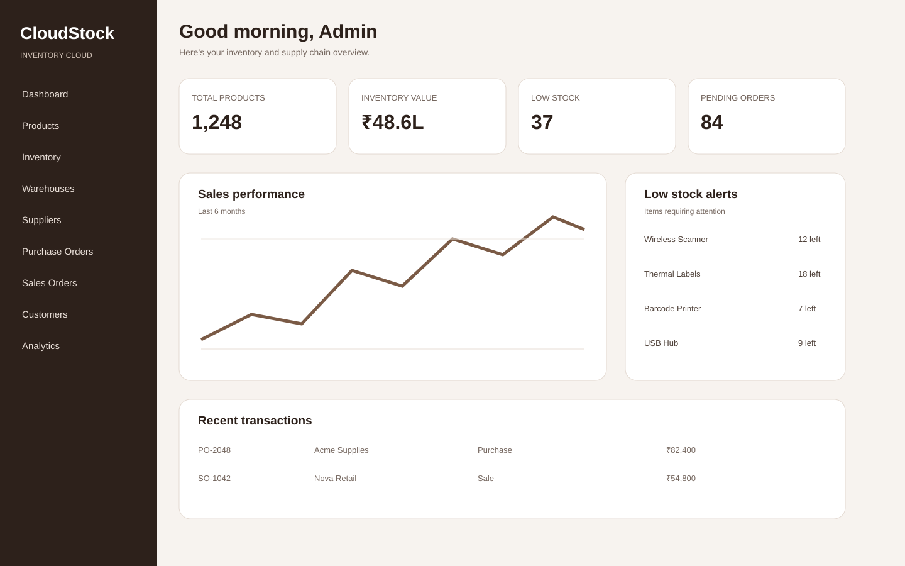
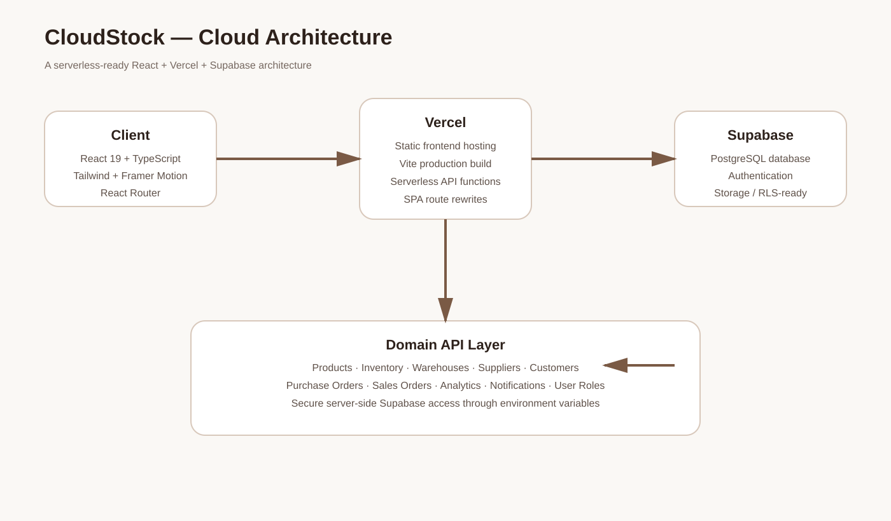

# CloudStock — Smart Inventory & Supply Chain Management

> A production-style cloud inventory platform for managing products, stock, warehouses, suppliers, customers and order workflows from a unified dashboard.



## Overview

CloudStock is a full-stack inventory and supply-chain management application built around a modern React frontend, serverless API endpoints and Supabase cloud services. It demonstrates practical cloud-computing concepts through authentication, managed database access, API-driven business workflows, analytics and cloud deployment.

### Why this project matters

This is designed as a **portfolio-grade cloud application**, not a basic CRUD demo. The architecture separates the presentation layer, API/domain layer and managed cloud data services so the project can be extended toward a production environment.

## Core capabilities

- **Role-aware access** — Admin, Manager and Staff workflows
- **Product management** — SKU, category, pricing, quantity, reorder levels and images
- **Inventory operations** — stock in/out, movement history and low-stock monitoring
- **Multi-warehouse management** — maintain inventory across locations
- **Supplier & customer management** — centralized business records
- **Purchase & sales orders** — track order lifecycle and transaction values
- **Analytics dashboard** — inventory value, sales, purchases, warehouse and stock insights
- **Notifications** — operational alerts and read/unread state
- **Settings & user management** — application configuration and user-role records
- **Responsive UX** — desktop, tablet and mobile-friendly layouts

## Technology stack

| Layer | Technology |
|---|---|
| Frontend | React 19, TypeScript, React Router |
| UI | Tailwind CSS 4, Framer Motion, Lucide React |
| Data visualization | Recharts |
| Backend | Vercel Serverless Functions / Node.js |
| Database | Supabase PostgreSQL |
| Authentication | Supabase Auth |
| Hosting | Vercel |
| Package manager | npm |

## System architecture



### Request flow

```text
Browser
  ↓
React + TypeScript UI
  ↓
Vercel hosting / Serverless API
  ↓
Supabase client (server-side for API operations)
  ↓
PostgreSQL + Authentication + Storage
```

## Project structure

```text
CloudStock/
├── api/                         # Serverless backend endpoints
│   ├── analytics.js
│   ├── customers.js
│   ├── inventory.js
│   ├── notifications.js
│   ├── products.js
│   ├── purchase-orders.js
│   ├── sales-orders.js
│   ├── settings.js
│   ├── stock-movements.js
│   ├── suppliers.js
│   ├── user-roles.js
│   ├── warehouses.js
│   └── db-client.js
├── public/                      # Static assets
├── src/
│   ├── components/              # Reusable UI components
│   ├── contexts/                # Authentication/application state
│   ├── lib/                     # Supabase client and utilities
│   ├── pages/                   # Feature pages
│   ├── App.tsx                  # Application routes
│   ├── App.css                  # Component styling
│   └── main.tsx                 # React entry point
├── docs/
│   ├── architecture/            # Architecture diagrams
│   └── screenshots/              # Project visuals
├── .env.example                 # Environment variable template
├── package.json                 # Scripts and dependencies
├── vite.config.ts               # Vite configuration
└── vercel.json                  # Vercel SPA routing
```

## Local development

### 1. Requirements

- Node.js 20+
- npm
- A Supabase project

### 2. Install dependencies

```bash
npm install
```

### 3. Configure environment variables

Create `.env.local` in the project root:

```env
VITE_SUPABASE_URL=https://YOUR_PROJECT.supabase.co
VITE_SUPABASE_ANON_KEY=YOUR_SUPABASE_PUBLISHABLE_OR_ANON_KEY
NEXT_PUBLIC_SUPABASE_URL=https://YOUR_PROJECT.supabase.co
SUPABASE_SERVICE_ROLE_KEY=YOUR_SUPABASE_SERVICE_ROLE_KEY
```

Never commit `.env.local` or expose the service-role key in frontend code.

### 4. Run

```bash
npm run dev
```

The Vite development server will show the local URL in the terminal.

### 5. Production build

```bash
npm run build
npm run preview
```

## Deploy to Vercel

Vercel is the recommended deployment target for this repository because the project contains both a Vite frontend and `/api` serverless functions.

1. Push this folder to a GitHub repository.
2. Open Vercel and choose **Add New → Project**.
3. Import the CloudStock GitHub repository.
4. Keep the detected framework as **Vite**.
5. Add the environment variables from `.env.local` in **Project Settings → Environment Variables**.
6. Deploy.
7. Open the generated Vercel URL and test `/login`, `/register`, dashboard pages and `/api/*` requests.
8. Put the live URL in the GitHub repository's **About → Website** field and README.

### Important security note

The browser should receive only the Supabase URL and publishable/anonymous key. The Supabase **service-role key must remain server-side** in Vercel environment variables. If a service-role key was previously committed to a public repository, rotate/revoke it in Supabase before publishing the repository.

## Render deployment

Render can host the frontend as a static site, but this repository also relies on the `/api` serverless endpoints. Therefore, **Vercel is the simpler single-deployment choice**. If Render is required, the API should be moved into a separate Node/Express service and the frontend configured to call that API URL.

## API surface

| Endpoint | Purpose |
|---|---|
| `/api/products` | Product CRUD |
| `/api/inventory` | Inventory records |
| `/api/warehouses` | Warehouse CRUD |
| `/api/suppliers` | Supplier CRUD |
| `/api/customers` | Customer CRUD |
| `/api/purchase-orders` | Purchase orders |
| `/api/sales-orders` | Sales orders |
| `/api/stock-movements` | Stock movement records |
| `/api/notifications` | Notifications |
| `/api/user-roles` | User-role records |
| `/api/settings` | Application settings |
| `/api/analytics` | Dashboard analytics |

## Cloud-computing concepts demonstrated

- Cloud-hosted web application
- Managed PostgreSQL database
- Cloud authentication
- Serverless backend/API execution
- Environment-based configuration and secret management
- API-driven architecture
- Scalable stateless request handling
- Cloud deployment and continuous delivery through GitHub integration
- Separation of client-side and server-side credentials

## Future enhancements

- Row Level Security policies for every business table
- Server-side JWT verification on API requests
- Automated reorder recommendations
- Scheduled email alerts
- Audit-log service
- Object storage for product documents
- Dockerized local development
- Automated tests and CI quality gates
- Advanced demand forecasting

## Portfolio

**Project:** CloudStock — Smart Inventory & Supply Chain Management System  
**Category:** Cloud Computing / Full Stack Development  
**Architecture:** React SPA + Serverless API + Managed PostgreSQL  
**Deployment:** Vercel + Supabase
